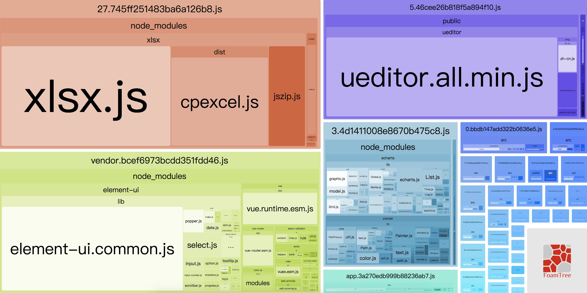

> 之前在社交平台上随手给一个朋友回答了个小问题，发现按需加载和代码分割的概念非常容易混淆，也无法对前端应用的性能进行实质的提升

## 按需加载

按需加载其实说起来非常高大上但是其实很简单，[element官网](http://element.eleme.io/#/zh-CN/component/quickstart)上就有简单的说明

可以看到其使用了一个很简单的特性，ES6的import特性，可以简单的为我们引入需要的组件等:

``` javascript
import Vue from 'vue';
import { Button, Select } from 'element-ui';
import App from './App.vue';

Vue.component(Button.name, Button);
Vue.component(Select.name, Select);
/* 或写为
 * Vue.use(Button)
 * Vue.use(Select)
 */

new Vue({
  el: '#app',
  render: h => h(App)
});
```

我们可以看到，其中在引入`element-ui`的时候，仅仅引入了我们所需要的两个组件。

`element-ui`为我们提供了许多丰富的组件，但是可能在日常开发中我们只能用到一小部分，那么这个特性就会很好的帮助我们进行第三方组件引入的最小化了。

不过我遇到的这位朋友使用的方法让我意想不到，给我描述的情况是，他的确只引入了需要的组件，但是整个前端应用还是非常的庞大，导致首屏加载仍然非常缓慢。

仔细询问发现，他只是单纯使用了按需加载的属性，将所有需要用到的组件都像实例那样进行了引入。实际上，如果仅仅单纯的地使用这个特性，在使用了80%以上组件的情况下，结果和整体引入ui库也并无区别。

## 代码分割

在我看来，按需加载实际上和代码分割的辅助功能是相辅相成的，在没有代码分割之下，所有的按需加载实际上仍然会将所有的第三方库全部压缩到一个工程文件中，导致该文件下载缓慢，运行缓慢。

实际上这一概念已经存在很久了无论是:

[vue-router 路由懒加载](https://router.vuejs.org/zh/guide/advanced/lazy-loading.html)

亦或是

[react code-splitting](https://reactjs.org/docs/code-splitting.html)

中都有提到，当然他们主要也是借用的`webpack`的一项特性[code-splitting](https://webpack.js.org/guides/code-splitting/)

我们在这篇介绍中可以看到，webpack为我们提供了一种动态`import`的功能：

``` javascript
import(/* webpackChunkName: "lodash" */ 'lodash');
```

就像文章中所说的，这种写法会帮我们将引入的文件单独进行一个文件的分割打包，这样我们庞大的应用就会被我们精心地拆成一个个单独的js文件，互不影响，异步加载，极大地节省了我们的首屏加载时间。

这里和**按需加载**是相辅相成的，我们可以把我们需要使用的第三方组件分布在我们的各个小组件中，并让这些组件进行代码分割，从而达到最大化优化效果的目的。

同样我们可以看到这个语法中有一行注释：

```
/* webpackChunkName: "lodash" */
```

`webpack`会根据我们注释中所写的`ChunkName`也就是我们为这个包起得名字，将相同名字的包打入到一个文件中，这样哪怕我们希望打入一个包的组件之间没有继承关系，也能在这里进行处理。

## 优化

代码分割和按需加载已经很大程度上为我们进行了前端优化了，我们还需要优化什么呢？

我的一些同事在代码分割上做的不是很理智，这里我们先介绍一个`webpack`推荐的分析辅助插件`webpack-bundle-analyzer`。

个人觉得这是一款非常好用的插件，只要进行简单的配置：

``` javascript
module.exports = {
  plugins: [
    new BundleAnalyzerPlugin({
      analyzerMode: 'server',
      analyzerHost: '0.0.0.0',
      analyzerPort: 8181,
      reportFilename: 'report.html',
      defaultSizes: 'parsed',
      openAnalyzer: true,
      generateStatsFile: false,
      statsFilename: 'stats.json',
      statsOptions: null,
      logLevel: 'info'
    })
  ]
}
```

配置项我这边不再赘述了，运行`NODE_ENV=production ANALYZ=true npm_config_report=true npm run build`后则会为我们生成一个直观的build报告：



我们可以看到，每一个文件都被分割成了和自身大小比例相等的块，抛去这些最大的引入，我们可以看到右下角有一些几乎看不清的小引入，这些都是同事开发的功能组件，非常的小。

根据这个分析，我们可以得到目前占用体积最大的组件是哪几个，如果过多的占用了我们的加载时间，则应该进行继续分割优化。

但是如果我们的组件非常的小，如右下方的组件，不足1KB，个人觉得就不用进行拆分了，和其父组件在一起就可以，否则这种细碎组件拆分过多，加载性能上没有太多提升反而加大了http请求的压力。